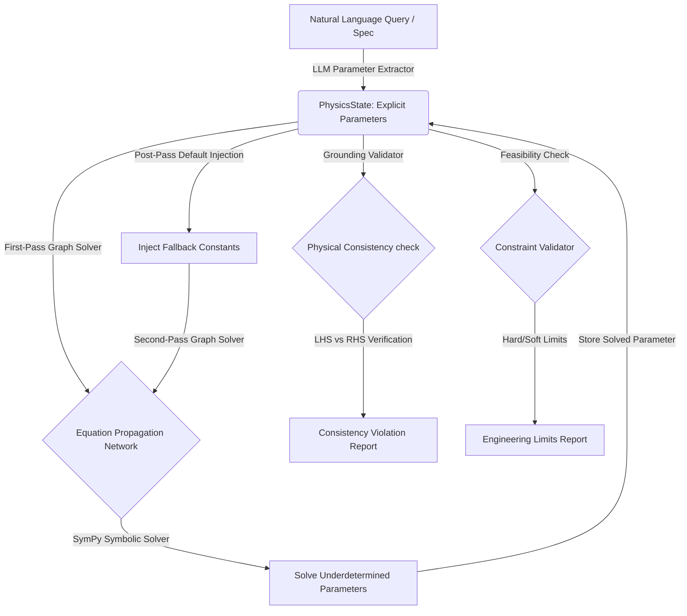

# 📡 Grounded Multi-Physics Engine & Verification System

A symbolic, LLM-enhanced physics calculation and physical consistency verification engine. This system parses natural language engineering specifications or design queries, translates them into base SI physics parameters, checks their physical consistency against registered scientific equations, and validates them against engineering/safety constraints.

---

## 🏗️ System Architecture

The engine uses a modular, graph-based planning pipeline that separates intent extraction, parameter storage, symbolic math solving, and constraint validation:



---

## 🚀 Key Features

### 1. Physical Grounding & Consistency Checks
Instead of just solving for a single target, the engine verifies the physical validity of a set of values:
- **Consistent Equation Checks**: For equations where all variables are known, the engine evaluates the difference between Left-Hand-Side (LHS) and Right-Hand-Side (RHS). If they differ by more than a 1% tolerance, a violation is flagged.
- **True Fallback Defaults**: Fallback constants (e.g. default internal resistance or time) are only injected *after* the first solving pass. This ensures default values never override or contradict calculated values.
- **Offset Unit Support**: Temperature offset conversions (like Celsius to Kelvin) are safely processed using `ureg.Quantity` constructors to prevent Pint unit errors.

### 2. Multi-Domain Support (8 Physics Families)
The engine has registered physical equations, parameters, and constraints across 8 fields:

1. **`rf` (Radio Frequency / Radar Budgets)**
   - Friis transmission equation, thermal noise power ($N = kTB$), and signal-to-noise ratio (SNR).
2. **`kinematics` (Classical Motion)**
   - SUVAT equations of motion and free-fall gravity.
3. **`dynamics` (Forces & Energy)**
   - Newton's second law ($F = ma$), momentum ($p = mv$), work ($W = Fd$), kinetic/potential energy, and power.
4. **`circuits` (Ohm's Law & Electricity)**
   - Ohm's law ($V = IR$), electrical power ($P = VI$), and electrical charge ($Q = It$).
5. **`thermodynamics` (Ideal Gases & Heat)**
   - Ideal gas law ($PV = nRT$) and heat energy ($Q = m c_{sp} dT$).
6. **`battery` (Battery Chemistry, Physics, and Thermal)**
   - Electrical power, charging C-rate current ($I = C_{rate} \cdot Q_{cap}$), internal resistance heating ($P_{heat} = I^2 R_{int}$), electrochemical cell potential (Nernst Equation), and rate kinetics (Arrhenius Equation).
7. **`aerospace` (Aerodynamics, Propulsion, Orbital Mechanics)**
   - Lift and drag equations, thrust-to-weight ratio, Tsiolkovsky Rocket Equation ($\Delta v = I_{sp} \cdot g \cdot \ln(m0/mf)$), Keplerian orbital period and orbital velocity.
8. **`lidar` (Lidar Transceivers & Optical Footprints)**
   - Aperture geometry, Time-of-Flight range ($R = c \cdot dt / 2$), footprint divergence, laser pulse energy, and the Lidar Range Equation.

---

## 💻 Operational Setup & Usage

### 📋 Prerequisites
Install dependencies:
```bash
pip install -r requirements.txt
```
Ensure you create a `.env` file in the project root:
```env
AZURE_OPENAI_ENDPOINT=https://<your-endpoint>.openai.azure.com/
AZURE_OPENAI_API_KEY=<your-api-key>
AZURE_OPENAI_CHAT_DEPLOYMENT_NAME=<your-deployment-name>
AZURE_OPENAI_API_VERSION=2024-02-01
```

### 💻 Running the Engine
Start the terminal interface:
```bash
python physics_engine/engine.py
```

### 🧪 Running the Test Suite
The codebase includes an automated test suite verifying SUVAT consistency/inconsistency, battery pack specification grounding, circuits, ideal gas laws, and rocket equations:
```bash
python physics_engine/test_suite.py
```

### 💬 Sample Queries
- **Verification Mode (Battery)**: *"LFP Battery Pack Thermal and Electrochemical Management System Designed for 3 C Fast-Charging at 150 A, 240 V with 60°C Temperature Limit and Active Cooling Capable of Dissipating 10 kW Heat under 5 mm Cooling Thickness Constraint"*
- **Target Solving (Aerospace)**: *"Compute the delta-v of a rocket stage with an initial mass of 10000 kg, an empty mass of 2000 kg, and a specific impulse of 300 seconds."*
- **Target Solving (Lidar)**: *"Compute the range R to a target if a lidar pulse returns with a round-trip time of flight of 2.0e-5 seconds."*
