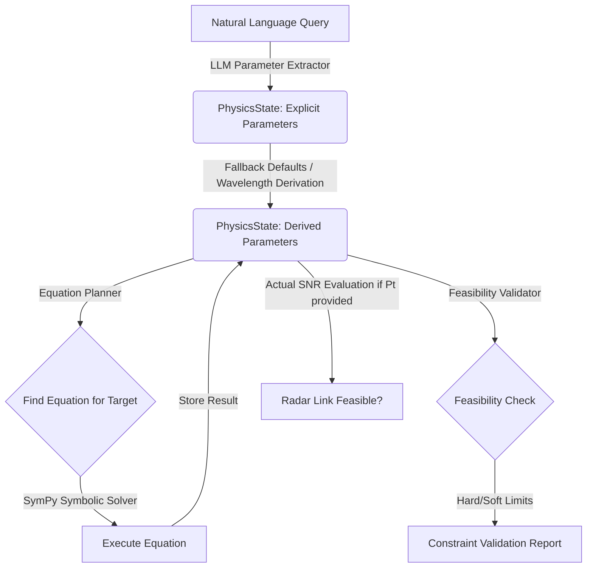

# 📡 RF Physics Solver Engine

A symbolic, LLM-enhanced physics calculation and validation engine designed to evaluate **Radio Frequency (RF)** and **Radar link budgets**. 

This system translates natural language queries (e.g., *"Calculate required transmit power for a 77GHz radar at 2km range"*) into formal symbolic equations, solves them using SymPy, and validates feasibility against physical and engineering constraints.

---

## 🏗️ System Architecture

The solver uses a pipeline structure that separates intent extraction, parameter storage, symbolic math solving, and constraint validation:



---

## 🚀 Execution Flow & Pipeline

1. **Natural Language Processing (`extractor/`)**:
   - The LLM Extractor uses Azure OpenAI to process a user's natural language input.
   - It filters inputs against a strict, predefined set of canonical parameters and converts all units (e.g., GHz, km, dBm) into standard SI units (Hz, meters, Watts).
2. **State Management (`state.py`)**:
   - Stores parameters in two categories: `explicit` (directly provided by user) and `derived` (computed or filled via defaults).
   - Injects fallback default settings for antenna gains ($G_t$, $G_r$), system temperature ($T$), and channel bandwidth ($B$) if missing.
   - Automatically derives wavelength ($\lambda = \frac{c}{f}$) if carrier frequency is provided.
3. **Symbolic Planning & Solving (`planner/`, `solver/`)**:
   - Matches desired unknown targets (such as thermal noise $N$, required received power $P_r$, and required transmit power $P_t$) to formulas in the registry.
   - Solves equations symbolically using **SymPy**, allowing multi-directional solving without hardcoded algebraic rearrangements.
4. **Feasibility Validation (`validation/`)**:
   - Validates calculated values against operational bounds (e.g., transmit power $P_t$ limits) to ensure the system is physically realizable and engineered realistically.

---

## 🗃️ RF Parameter & Schema Reference

All parameter inputs and outputs use standard SI units to ensure computational consistency:

| Parameter | Symbol | Canonical Name | Default Value | Standard SI Unit | Description |
|:---:|:---:|:---|:---:|:---:|:---|
| $P_t$ | `Pt` | Transmit Power | *Calculated* / User Input | Watts ($W$) | Power transmitted by the radar source |
| $f$ | `frequency` | Carrier Frequency | *Required* | Hertz ($Hz$) | Carrier frequency of the signal |
| $\lambda$ | `lam` | Wavelength | $\frac{3 \times 10^8}{f}$ | Meters ($m$) | Derived wavelength of carrier frequency |
| $R$ | `R` | Range | *Required* | Meters ($m$) | Distance to target/receiver |
| $G_t$ | `Gt` | Tx Antenna Gain | `3.16` ($5\text{ dBi}$) | Linear ratio | Gain of the transmitting antenna |
| $G_r$ | `Gr` | Rx Antenna Gain | `3.16` ($5\text{ dBi}$) | Linear ratio | Gain of the receiving antenna |
| $B$ | `B` | Bandwidth | `1,000,000` | Hertz ($Hz$) | Channel or system bandwidth |
| $T$ | `T` | Noise Temperature | `290` | Kelvin ($K$) | Equivalent physical noise temperature |
| $N$ | `N` | Thermal Noise Power | *Calculated* | Watts ($W$) | $k \cdot T \cdot B$ where $k = 1.38 \times 10^{-23}\text{ J/K}$ |
| $\text{SNR}$ | `SNR` | Signal-to-Noise Ratio | *Calculated* | Linear ratio | Ratio of received signal power to noise power |

---

## 📐 Supported RF Equations Registry

### 1. Thermal Noise Power
Computes the baseline thermal noise level of the receiver channel.
$$\text{Equation: } N = k \cdot T \cdot B$$
*   **Constant ($k$):** Boltzmann constant ($1.380649 \times 10^{-23}\text{ J/K}$)
*   **Inputs:** `T` (Noise Temperature), `B` (Bandwidth)
*   **Outputs:** `N` (Noise Power)

### 2. Friis Transmission Equation (Path Loss)
Models the power received by an antenna under free-space conditions.
$$\text{Equation: } P_r = P_t \cdot G_t \cdot G_r \cdot \left(\frac{\lambda}{4\pi R}\right)^2$$
*   **Inputs:** `Pt` (Transmit Power), `Gt` (Tx Gain), `Gr` (Rx Gain), `lam` (Wavelength), `R` (Range)
*   **Outputs:** `Pr` (Received Power)

### 3. Friis Transmission Inverse (Transmit Power)
Computes the required transmit power needed to achieve a target received power $P_r$.
$$\text{Equation: } P_t = \frac{P_r}{G_t \cdot G_r \cdot \left(\frac{\lambda}{4\pi R}\right)^2}$$
*   **Inputs:** `Pr` (Received Power), `Gt` (Tx Gain), `Gr` (Rx Gain), `lam` (Wavelength), `R` (Range)
*   **Outputs:** `Pt` (Transmit Power)

### 4. Signal-to-Noise Ratio (SNR)
Computes the ratio of received signal power to thermal noise power.
$$\text{Equation: } \text{SNR} = \frac{P_r}{N}$$
*   **Inputs:** `Pr` (Received Power), `N` (Noise Power)
*   **Outputs:** `SNR` (Linear Ratio)

---

## 🛡️ Approach Validation & Structural Assessment

After a deep architectural audit of the codebase, we have validated the current implementation. Below is an objective analysis of the system's strengths, weaknesses, and architectural recommendations:

### 🌟 Strengths & Core Design Advantages
*   **Symbolic Decoupling:** By leveraging SymPy (`sympy`), the solver avoids hardcoding mathematical derivations for inverse calculations. The system solves equations dynamically for any desired target parameter.
*   **Clear Separation of Concerns:**
    *   `extractor/` focuses purely on semantic parsing.
    *   `state/` maintains current physical state without solver-related side-effects.
    *   `solver/` and `planner/` isolate symbolic computation from physical semantics.
    *   `validation/` encapsulates engineering and regulatory thresholds separately.
*   **Strict Canonical Mapping:** Using a fixed parameter schema (`rf_schema.py`) ensures that natural language extraction is grounded to exact mathematical symbols, preventing variable names collision.

### ⚠️ Vulnerabilities & Identified Flaws

#### 1. [FIXED] SNR Symbol Map Crash
*   **Issue:** `physics_engine/equations/snr.py` originally lacked the `"symbol_map"` property. When attempting to calculate SNR, `execute_equation` triggered a fatal `KeyError: 'symbol_map'`.
*   **Resolution:** Symbol map mapping `Pr`, `N`, and `SNR` symbols has been successfully added to `SNR_METADATA` to restore functionality.

#### 2. Conflict & Redundancy in Feasibility Validation
*   **Issue:** The system defines validation parameters in two conflicting files:
    1.  `validation/rf_limits.py` (defines `Pt` with `soft_max=100` and `hard_max=10000`).
    2.  `validation/rf_constraints.py` (defines `Pt` with `max=100` and `frequency` with `max=100e9`).
*   Only `feasibility.py` (referencing `rf_limits.py`) is used during the runtime pipeline. `rf_constraints.py` is entirely dead code and represents an inconsistent source of truth.
*   **Impact:** Modifying constraint limits requires checking multiple files, introducing developer error.

#### 3. Linear Sequence Assumptions in `engine.py`
*   **Issue:** The pipeline in `engine.py` executes in a highly procedural, hardcoded sequence:
    1.  `N` (Noise Power)
    2.  `required_Pr`
    3.  `required_Pt`
    4.  `actual_Pr` / `actual_SNR` (if `Pt` was explicitly provided)
*   **Impact:** If the user changes the query to ask for the maximum achievable **Range ($R$)** given a transmit power, the hardcoded control flow in `engine.py` cannot resolve it, even though SymPy is fully capable of planning and solving for `R`. The execution pipeline is not truly dynamic.

#### 4. LLM Response Fragility
*   **Issue:** `llm_extractor.py` relies on raw JSON strings returned by the Azure OpenAI LLM, without structured parsing schemas or retry blocks. If the LLM returns trailing markdown symbols (e.g. ` ```json ` blocks), `json.loads(raw)` will fail, returning `{}` and halting the pipeline.

---

## 🛠️ Operational Setup & Usage

### 📋 Prerequisites
Install all dependencies using pip:
```bash
pip install -r requirements.txt
```
Ensure you create a `.env` file at the project root with your Azure OpenAI credentials:
```env
AZURE_OPENAI_ENDPOINT=https://<your-endpoint>.openai.azure.com/
AZURE_OPENAI_API_KEY=<your-api-key>
AZURE_OPENAI_CHAT_DEPLOYMENT_NAME=<your-deployment-name>
AZURE_OPENAI_API_VERSION=2023-05-15
```

### 💻 Running the Solver
Start the terminal interface:
```bash
python physics_engine/engine.py
```

### 💬 Sample Queries
*   *"What is the required transmit power for a 24GHz radar targeting an object at a range of 150 meters?"*
*   *"Calculate required Pt for a carrier frequency of 77e9 Hz, range 500m, with 10W transmit power."*
